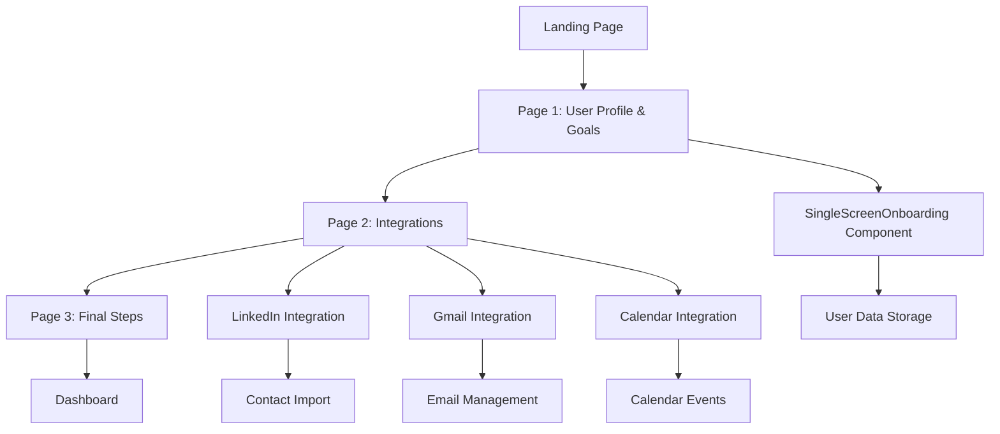

# Unified Onboarding Flow Plan

## Overview

This document outlines the official plan for ConnectorPro's new unified onboarding flow. The flow consists of three distinct pages that guide users through profile setup, platform integrations, and final configuration steps.

## Architecture Overview



## Page 1: User Profile & Goals

### Component Base
- **Primary Component**: [`SingleScreenOnboarding.tsx`](../components/onboarding/SingleScreenOnboarding.tsx)
- **Status**: Existing component to be used as-is with minor modifications

### User Actions & Data Collection

#### 1. Persona Selection
- **UI Element**: Select dropdown with persona cards
- **Options**: 
  - Job Seeker (Briefcase icon)
  - Solo Consultant (TrendingUp icon)
  - Community Manager (Users icon)
  - Sales Representative (Target icon)
- **Data Stored**: `persona: User['role']`
- **Validation**: Required field

#### 2. Networking Goals Selection
- **UI Element**: Multi-select dropdown with inline tags
- **Behavior**: Dynamic goals based on selected persona
- **Goal Categories**:
  - **Job Seeker**: Research & Referrals, Hiring Decision-Makers, Expand Network
  - **Consultant**: Revive Relationships, Generate Referrals, Expand Network
  - **Community Manager**: Event Networking, Sponsor Relationships, Community Growth
  - **Sales Rep**: Warm Introductions, Leverage Relationships, Expand Network
- **Data Stored**: `networkingGoals: string[]`
- **Validation**: At least one goal required

#### 3. Basic Information
- **Fields**:
  - First Name (required)
  - Last Name (required)
  - Email Address (required)
  - LinkedIn Profile URL (required)
- **Features**:
  - Dynamic LinkedIn URL placeholder generation
  - Email validation
  - Auto-fill from localStorage if available
- **Data Stored**: `firstName`, `lastName`, `email`, `linkedinProfileUrl`

#### 4. Target Companies (Optional)
- **UI Elements**:
  - Popular company badges (clickable)
  - Custom company input field
  - Selected companies display
- **Popular Companies**: Google, Meta, Apple, Microsoft, Amazon, Netflix, Tesla, Stripe, etc.
- **Data Stored**: `targetCompanies: string[]`
- **Validation**: Optional field

### Key Components Used
- [`Card`](../components/ui/card.tsx), [`Button`](../components/ui/button.tsx), [`Input`](../components/ui/input.tsx)
- [`Select`](../components/ui/select.tsx), [`Badge`](../components/ui/badge.tsx)
- Lucide icons: Network, Briefcase, TrendingUp, Users, Target, etc.

### Data Flow
1. User selects persona → Goals dynamically update
2. User fills basic info → LinkedIn placeholder updates
3. User selects companies → Badge display updates
4. Form validation → Enable/disable continue button
5. On submit → Data passed to Page 2

---

## Page 2: Integrations

### Component Base
- **Integration Components**:
  - [`LinkedInIntegration.tsx`](../components/integrations/LinkedInIntegration.tsx)
  - [`GmailIntegration.tsx`](../components/integrations/GmailIntegration.tsx)
  - [`CalendarIntegration.tsx`](../components/integrations/CalendarIntegration.tsx)

### Integration Sections

#### 1. LinkedIn Integration (Required)
- **Purpose**: Import user's LinkedIn network for analysis
- **Options**:
  - **Option A**: LinkedIn API Connection (Quick)
    - Uses RapidAPI LinkedIn Scraper
    - Instant network import
    - Status check via `/api/v1/linkedin/rapidapi/status`
  - **Option B**: CSV Upload (Manual)
    - File upload with drag-and-drop
    - Supports CSV, Numbers, Excel formats
    - Instructions for downloading LinkedIn connections
    - Sample CSV download available
- **Features**:
  - Progress indicator during upload
  - File validation (5MB limit)
  - Import results display
  - Persistent state storage
- **Data Stored**: Connection status, imported contacts, file metadata
- **Validation**: Either API connection OR successful CSV upload required

#### 2. Gmail Integration (Recommended)
- **Purpose**: Send introduction requests and manage email communications
- **Features**:
  - OAuth2 authentication flow
  - Email provider detection based on user's email
  - Popup-based authorization
  - Connection status verification
- **Capabilities**:
  - Send emails with HTML/text support
  - Load emails from target companies
  - Enhanced filtering with tool-originated email detection
  - Search functionality
- **Data Stored**: Connection status, email address, scopes, last connected timestamp
- **Validation**: Optional but recommended

#### 3. Calendar Integration (Optional)
- **Purpose**: Schedule meetings and manage calendar events
- **Features**:
  - Google Calendar OAuth2 integration
  - Multiple calendar support
  - Event creation with attendees
  - Time zone handling
- **Capabilities**:
  - View available calendars
  - Create events with video links
  - Manage attendees and locations
- **Data Stored**: Connection status, available calendars, permissions
- **Validation**: Optional

### Integration Flow
1. **LinkedIn Setup** (Required)
   - User chooses API connection or CSV upload
   - System validates and imports contacts
   - Success state enables progression
2. **Email Setup** (Recommended)
   - System detects email provider from Page 1
   - User authorizes Gmail/other provider
   - Connection verified and stored
3. **Calendar Setup** (Optional)
   - User authorizes Google Calendar
   - System loads available calendars
   - Integration ready for event creation

### Privacy & Security
- **Data Encryption**: All tokens encrypted in storage
- **Scope Limitations**: Minimal required permissions
- **User Control**: Easy disconnect options
- **Transparency**: Clear permission explanations

---

## Page 3: Final Steps

### Purpose
Complete the onboarding process with final configuration and welcome messaging.

### User Actions & Configuration

#### 1. Preferences Setup
- **Message Tone Selection**:
  - Professional (Formal and business-focused)
  - Friendly (Warm and approachable)
  - Concise (Brief and to the point)
- **Commonality Priority Ordering**:
  - Drag-and-drop interface for prioritizing:
    - Shared Employer
    - Same School/University
    - Mutual Connections
    - Same Events/Communities

#### 2. Integration Summary
- **Display Connected Services**:
  - LinkedIn: Connection status and contact count
  - Gmail: Connected email address
  - Calendar: Connected calendar count
- **Quick Actions**:
  - Test email sending
  - Create sample calendar event
  - View imported contacts preview

#### 3. Onboarding Completion
- **Welcome Message**: Personalized based on persona and goals
- **Next Steps Guidance**:
  - Dashboard tour preview
  - Key features highlight
  - First networking recommendation
- **Data Finalization**:
  - User profile creation
  - Preferences storage
  - Integration state persistence

### Components Required
- Preference selection UI
- Integration status cards
- Welcome/success messaging
- Navigation to dashboard

---

## Data Flow & Storage

### Data Structure
```typescript
interface UnifiedOnboardingData {
  // Page 1 Data
  persona: User['role'];
  firstName: string;
  lastName: string;
  email: string;
  linkedinProfileUrl: string;
  networkingGoals: string[];
  targetCompanies: string[];
  
  // Page 2 Data
  linkedinConnected: boolean;
  emailConnected: boolean;
  calendarConnected: boolean;
  csvUploaded: boolean;
  csvImportResult: any;
  uploadedFiles: UploadedFile[];
  
  // Page 3 Data
  draftTone: 'professional' | 'friendly' | 'concise';
  commonalityOrder: ('employer' | 'education' | 'mutual' | 'event')[];
}
```

### Storage Strategy
- **localStorage**: Persistent state across sessions
- **Centralized Storage**: Using [`storage.ts`](../lib/storage.ts) utility
- **Data Validation**: Type-safe interfaces and validation
- **State Recovery**: Ability to resume interrupted onboarding

### API Endpoints Used
- `POST /api/v1/contacts/import/csv` - CSV contact import
- `GET /api/v1/linkedin/rapidapi/status` - LinkedIn API status
- `GET /api/v1/gmail/status` - Gmail connection status
- `GET /api/v1/gmail/auth-url` - Gmail OAuth URL
- `GET /api/v1/calendar/status` - Calendar connection status
- `GET /api/v1/calendar/auth-url` - Calendar OAuth URL

---

## Component Relationships

### Shared Components
- **UI Components**: Card, Button, Input, Select, Badge, Alert, Progress
- **Icons**: Lucide React icons for consistent visual language
- **Utilities**: Storage, validation, formatting functions

### State Management
- **Page-level State**: Each page manages its own form state
- **Persistent State**: Critical data stored in localStorage
- **Cross-page Communication**: Data passed through props and storage

### Error Handling
- **Validation Errors**: Real-time form validation with user feedback
- **API Errors**: Graceful error handling with retry options
- **Network Issues**: Offline state detection and recovery

---

## Implementation Considerations

### Progressive Enhancement
- **Core Functionality**: Works without JavaScript for basic form submission
- **Enhanced Experience**: Rich interactions with JavaScript enabled
- **Mobile Responsive**: Optimized for all device sizes

### Performance
- **Lazy Loading**: Integration components loaded on-demand
- **Efficient Rendering**: Minimal re-renders with proper state management
- **File Upload**: Chunked uploads for large CSV files

### Accessibility
- **Keyboard Navigation**: Full keyboard accessibility
- **Screen Readers**: Proper ARIA labels and descriptions
- **Color Contrast**: WCAG compliant color schemes
- **Focus Management**: Logical tab order and focus indicators

### Testing Strategy
- **Unit Tests**: Individual component testing
- **Integration Tests**: Cross-component data flow testing
- **E2E Tests**: Complete onboarding flow testing
- **Accessibility Tests**: Automated accessibility validation

---

## Success Metrics

### Completion Rates
- **Page 1 Completion**: Target 95%+ (basic info collection)
- **Page 2 Completion**: Target 80%+ (at least LinkedIn integration)
- **Full Flow Completion**: Target 70%+ (all three pages)

### Integration Adoption
- **LinkedIn Integration**: Target 95%+ (required)
- **Gmail Integration**: Target 60%+ (recommended)
- **Calendar Integration**: Target 30%+ (optional)

### User Experience
- **Time to Complete**: Target <5 minutes for full flow
- **Error Rate**: Target <5% validation errors
- **User Satisfaction**: Target 4.5/5 rating

---

## Future Enhancements

### Additional Integrations
- **Outlook Integration**: Email and calendar for Microsoft users
- **Slack Integration**: Team communication and networking
- **CRM Integration**: Salesforce, HubSpot connectivity

### Advanced Features
- **Bulk Contact Import**: Multiple file upload support
- **Smart Recommendations**: AI-powered setup suggestions
- **Social Proof**: Show popular choices and success stories

### Analytics & Optimization
- **Conversion Tracking**: Detailed funnel analysis
- **A/B Testing**: Component and flow optimization
- **User Behavior**: Heat mapping and interaction tracking

---

## Conclusion

This unified onboarding flow provides a comprehensive, user-friendly experience that efficiently collects user information, establishes platform integrations, and prepares users for successful networking with ConnectorPro. The three-page structure balances thoroughness with simplicity, ensuring high completion rates while gathering all necessary data for personalized networking recommendations.

The plan leverages existing, well-tested components while providing clear specifications for any new development needed. The modular architecture allows for future enhancements and integrations while maintaining a solid foundation for the core user experience.